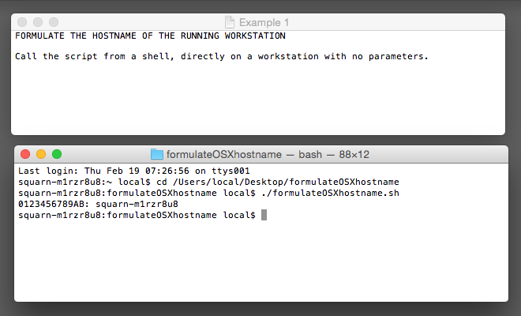
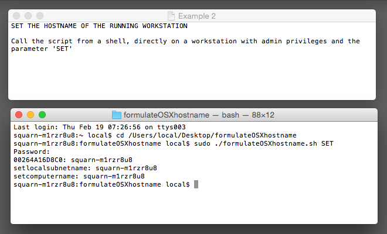
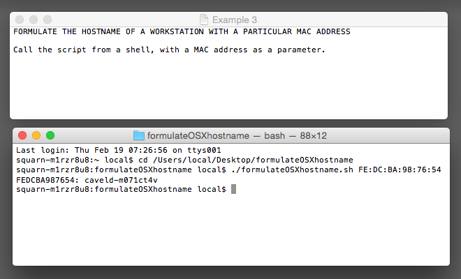
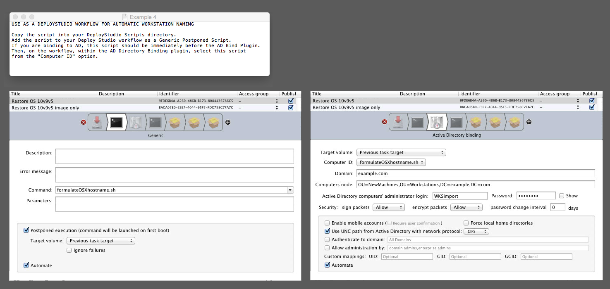

# formulateOSXhostname
Formulate a 15 char unique hostname based solely on MAC address

##Description:

Formulates a 15 char unique hostname based solely on MAC address

The generated name has the following properties

* The name is unique to the workstion
* The name is compatibile with Active Directory
* The first 6 characters are readable and pronouncable.

The script can be used to rename workstations, check the hostname for a particular MAC address, or as a workflow script in Deploystudio.

I needed a workstation naming convention that allowed me to image workstations straight out of the box, with zero pre-setup paperwork and zero dependency on any other team. This is it.

##Installation:

If you are using DeployStudio, copy the script into your DeployStudio Scripts directory, otherwise just copy it anywhere that's convenient and make use of it however you want to.

##How To Use:

###Example 1

**Formulate and print a hostname for a workstation**

Call the script from a shell, directly on a workstation with no parameters, i.e:

	formulateOSXhostname.sh
	
	(Outputs the workstation MAC address, followed by the generated workstation name)

###Example 2
**Formulate and set the hostname for a workstation**

Call the script from a shell, directly on a workstation with admin privileges
and the parameter 'SET', i.e:

	  sudo formulateOSXhostname.sh SET

###Example 3
**Formulate and print a hostname for a workstation with a particular MAC address**

Call the script from a shell, with a MAC address as a parameter, i.e:

	  formulateOSXhostname.sh 01:23:45:67:89:AB

	  (Outputs the MAC address, followed by the generated workstation name)

###Example 4
**Use as a DeployStudio workflow for automatic workstation naming**

1. Copy the script into your DeployStudio Scripts directory.

2. Add the script to your Deploy Studio workflow as a Generic Postponed Script. If you are binding to AD, this script should be immediately before the AD Bind Plugin.

3. In the workflow, within the AD Directory Binding plugin, select this script from the "Computer ID" option.

		(outputs "RuntimeSetBindingComputerID: hostname")

##History:

1.0.3 - 07 JUN 2016

* Moved to GitHub

1.0.2 - 26 AUG 2015

* Bug fix that prevented it working as a deploy studio postponed script.  
* When available, it now uses DHCP option 15 (domain name) when setting the hostname. 

1.0.1 - 18 FEB 2015

* First public release.
